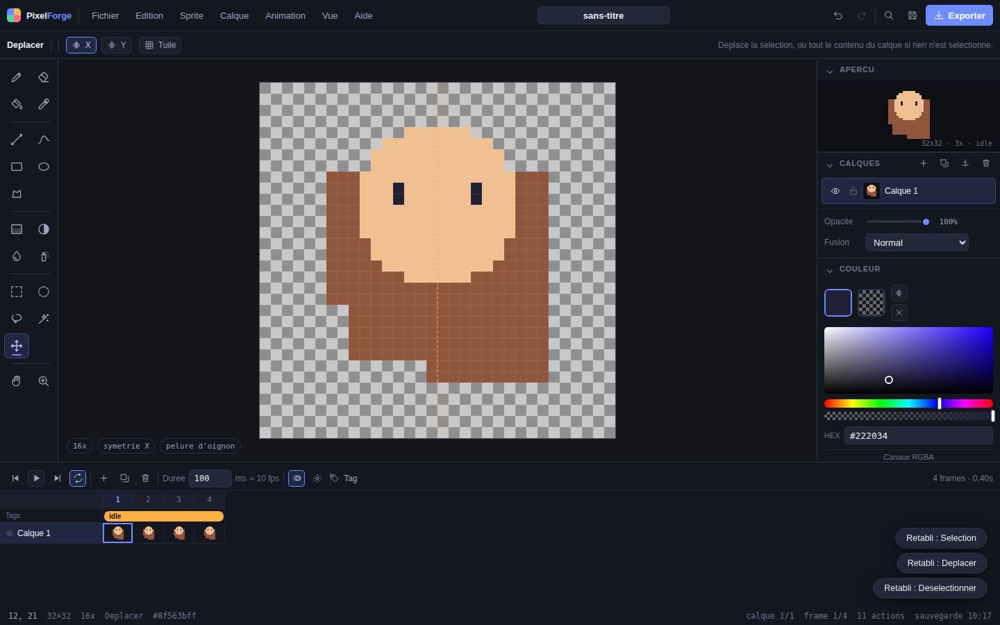
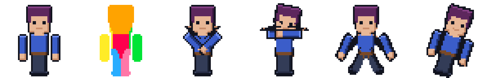
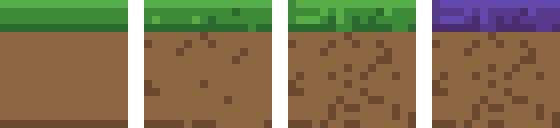
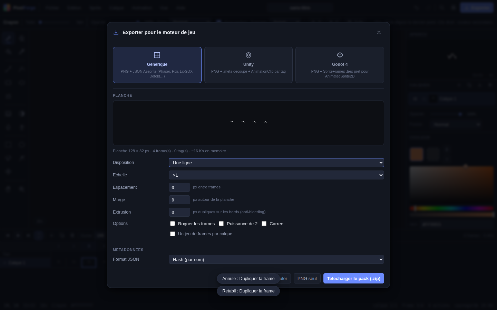
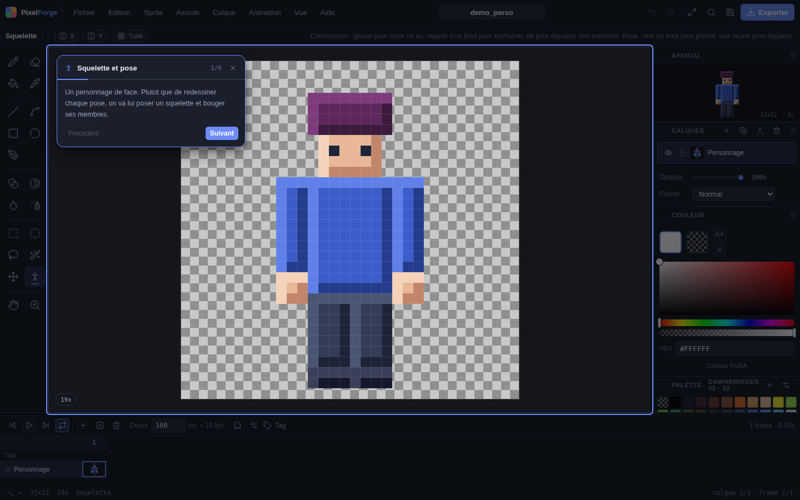
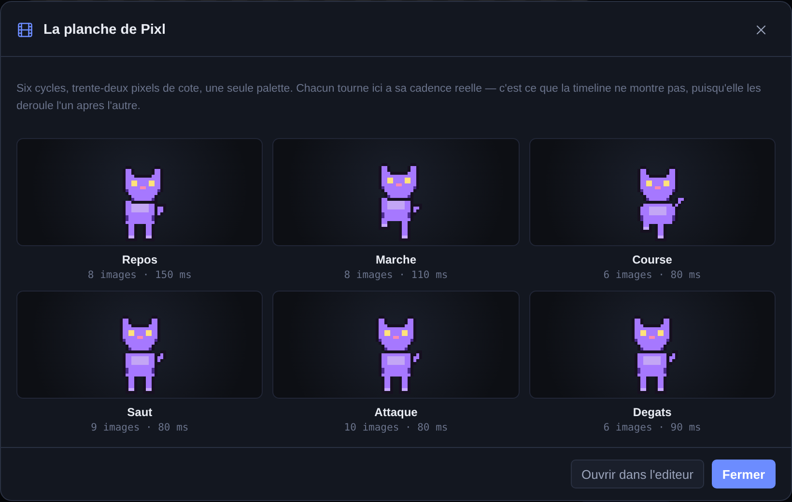
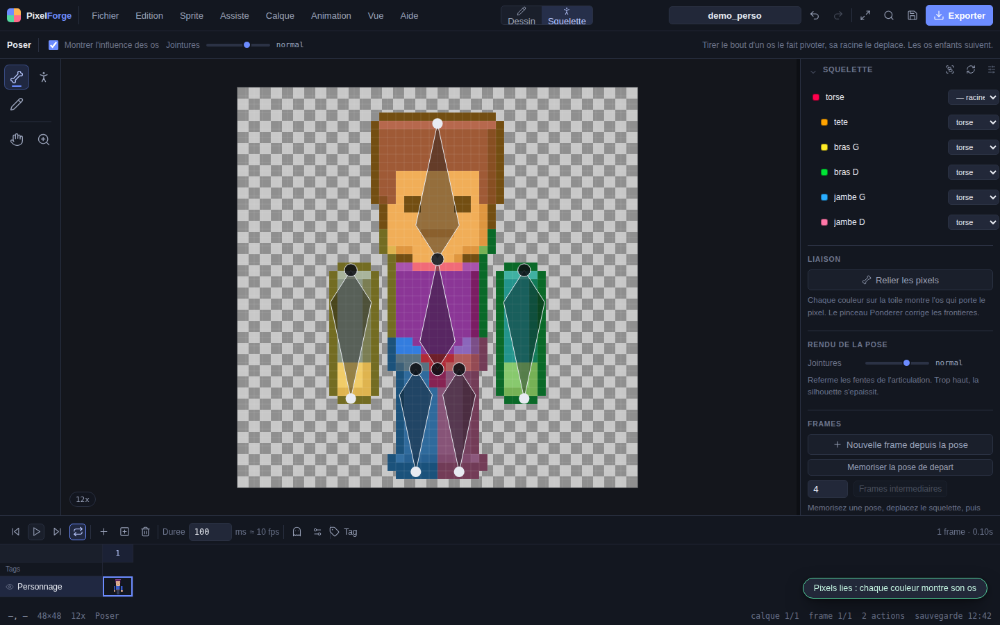

# PixelForge

Éditeur de sprites et d'animation pixel art dans le navigateur, pensé pour le
game dev. Dessin, timeline, tags d'animation, et surtout des exports qui
tombent directement dans un projet Unity ou Godot sans retouche.

Tout tourne côté client : aucun serveur, aucune donnée envoyée. Le document
vit dans l'onglet et une sauvegarde automatique reste dans le stockage local
du navigateur. La sauvegarde dans Google Drive existe, mais elle est
facultative et ne s'active qu'à la demande : sans compte connecté, l'éditeur
est exactement le même.



## Démarrer

```bash
npm install
npm run dev      # http://localhost:5173
```

```bash
npm run build    # génère dist/ (site statique, déployable tel quel)
npm run preview  # sert le build
```

## Déploiement

L'image finale ne contient que nginx et les fichiers construits : **21,5 Mo**,
dont 288 Ko de site. Ni Node, ni `node_modules`, ni sources. Elle tourne en
utilisateur non privilégié sur le port **8080**.

### Dokploy

Le `Dockerfile` et le `docker-compose.yml` sont à la racine, les deux types
d'application fonctionnent.

**Application (le plus court)**

1. **Create Application** → source **GitHub**, ce dépôt, branche `main`.
2. Build Type : **Dockerfile** (détecté tout seul).
3. **Port : `8080`** — l'image n'écoute pas sur 80, c'est ce qui lui permet
   de tourner sans droits root.
4. **Domains** → domaine + HTTPS → **Deploy**.

**Docker Compose**

Pointer sur `docker-compose.yml`, puis onglet **Domains** : Host = votre
domaine, Service = `pixelforge`, Container Port = `8080`.

Ce fichier ne publie **aucun port sur l'hôte** : Traefik joint le conteneur
par le réseau interne `dokploy-network`. C'est ce que Dokploy attend, et cela
évite le conflit `port is already allocated` si un autre service occupe déjà
le port sur la machine.

Aucune variable d'environnement n'est requise : l'application est entièrement
statique. La seule qui existe, `VITE_GOOGLE_CLIENT_ID`, active la sauvegarde
facultative dans Google Drive et se passe très bien d'être définie (voir
[Google Drive](#google-drive-facultatif)).

### Docker, sans Dokploy

Le second fichier publie le port sur l'hôte :

```bash
docker compose -f docker-compose.local.yml up -d --build   # http://localhost:8080
PIXELFORGE_PORT=8090 docker compose -f docker-compose.local.yml up -d   # autre port
```

```bash
# ou sans compose
docker build -t pixelforge .
docker run -d -p 8080:8080 --name pixelforge pixelforge
```

Les deux fichiers appliquent le même durcissement, vérifié au lancement :
système de fichiers en lecture seule, `cap_drop: ALL`, `no-new-privileges`,
et les fichiers temporaires de nginx en mémoire.

### Ce que fait l'image

- **Construction en deux étapes** : Node compile puis disparaît. Les
  dépendances sont dans une couche distincte du code, donc un changement de
  source ne réinstalle rien.
- **Le typage est vérifié pendant le build** : une erreur casse l'image au
  lieu d'arriver en production.
- **Compression au build** : les fichiers sont pré-compressés en gzip et
  servis tels quels via `gzip_static`. Le bundle passe de 180 Ko à 58 Ko sans
  aucun travail à chaque requête.
- **Cache** : les assets ont un nom haché, donc `immutable` pendant un an ;
  `index.html` est en `no-cache`, ce qui évite qu'un déploiement laisse des
  navigateurs sur l'ancienne version.
- **En-têtes** : CSP stricte (`default-src 'self'` — `blob:` et `data:`
  restent autorisés pour les exports), `nosniff`, `no-referrer`,
  `frame-ancestors 'none'`. Les seules origines externes tolérées sont celles
  de Google Drive : le script de connexion, son iframe de renouvellement et
  l'API. `Cross-Origin-Opener-Policy` est en `same-origin-allow-popups`, sans
  quoi la fenêtre de connexion ne pourrait pas répondre à la page.
- **Sonde `/healthz`** utilisée par le `HEALTHCHECK` du conteneur et
  exploitable par l'orchestrateur.

### Hébergement statique

`npm run build` produit un `dist/` autonome en chemins relatifs : il se dépose
tel quel sur Netlify, Vercel, GitHub Pages, Cloudflare Pages ou un simple
bucket, sans configuration.

## Ce qu'on peut faire

### Dessiner

20 outils : crayon, gomme, pot de peinture, pipette, ligne, courbe de Bézier,
rectangle, ellipse, contour libre, dégradé, ombrage, flou, aérographe, les
quatre modes de sélection (rectangle, ellipse, lasso, baguette magique),
déplacement, main et loupe.

- **Pixel perfect** : le filtre anti-coins d'Aseprite, actif par défaut sur les
  traits de 1 px.
- **Brosses** ronde, carrée, losange et lignes, de 1 à 64 px.
- **Modes de pose** : normal, derrière, alpha verrouillé.
- **Tramage** : Bayer 2/4/8, damier, lignes, bruit, avec ratio réglable — le
  dégradé peut lui aussi être tramé plutôt qu'interpolé.
- **Symétrie** X et Y en direct, **mode tuile** où le trait se replie sur les
  bords opposés (avec aperçu 3×3 pour vérifier le raccord).
- **Ombrage** : éclaircit au clic gauche, assombrit au clic droit, et
  réaligne le résultat sur la palette du sprite.
- 19 modes de fusion de calque, opacité par calque et par case.

### Animer

- Timeline calques × frames avec vignettes, durée par frame, réordonnancement.
- **Tags d'animation** (`idle`, `run`, `hit`…) avec sens de lecture avant,
  arrière, aller-retour, et nombre de répétitions.
- **Pelure d'oignon** jusqu'à 3 frames avant et après, teintées rouge/bleu.
- Lecture en direct sur la toile, limitée au tag courant si besoin.

### Effets de calque

Les effets se posent sur un **calque**, pas sur des pixels : ils sont
recalculés au moment de composer l'image. On règle donc une ombre en la
regardant bouger, on la coupe d'un clic, on revient en arrière sans perte —
et le dessin d'origine reste intact sur toutes les frames.

Huit effets : **ombre portée**, **ombre interne**, **lueur externe**,
**lueur interne**, **contour**, **biseau**, **teinte**, **dégradé**. La
section EFFETS du panneau Calques les liste ; le menu Calque les pose aussi
d'un coup.

Un point les sépare de leurs équivalents en maquette : **il n'y a pas de
flou gaussien**. Un flou fabriquerait des centaines de couleurs et casserait
le pixel art. L'atténuation se règle sur trois positions :

| Bord | Ce qu'il fait | Couleurs ajoutées |
| --- | --- | --- |
| **Net** | l'effet s'arrête franchement | 1 |
| **Paliers** | 2 à 6 niveaux d'opacité | autant que de paliers |
| **Trame** | un motif de Bayer régulier remplace le dégradé | 1 |

La distance au bord est mesurée par une transformée exacte, pas approchée :
une lueur tramée dessine de vrais anneaux ronds, pas des losanges.

Le **retrait** existe pour les dessins déjà cernés d'un contour sombre : il
fait démarrer un biseau ou une lueur interne quelques pixels plus loin, sur
la matière, au lieu de délaver le trait.

Les effets partent tels quels dans la planche, le GIF et les exports moteur.
`Calque > Graver les effets` les inscrit dans les pixels quand on veut les
retoucher à la main.

### Travailler avec l'assistant

Trois fonctions s'appuient sur une analyse du dessin plutôt que sur des
réglages aveugles. Les couleurs du sprite sont d'abord regroupées en
**familles** — les teintes d'une même gamme classées de l'ombre à la
lumière. C'est l'unité de travail naturelle du pixel art : un vêtement, une
peau, un feuillage sont chacun une famille.



*De gauche à droite : le dessin de repos, la carte des os — une couleur par
os, qui montre à qui appartient chaque pixel — puis quatre poses.*

#### Tourner en 3D — `Ctrl+Maj+R`

Le squelette fait pivoter des membres **dans le plan du dessin**. Il ne sait
pas montrer un trois-quarts : pour cela il faudrait savoir ce qu'il y a
derrière, et un dessin plat ne le dit pas.

On le devine. Chaque pixel reçoit une **épaisseur**, lue dans la silhouette :
loin du bord, la matière est épaisse ; sur le contour, elle est mince. Le
dessin cesse d'être une image et devient un volume dont il est la tranche du
milieu. Tourner revient alors à faire tourner ce volume et à le reprojeter —
les occultations tombent juste, sans qu'aucun modèle 3D n'existe.

Trois angles (lacet, tangage, roulis) et deux réglages de relief (hauteur,
galbe). Le résultat s'applique sur place ou part sur sa propre frame.

**Rien n'est interpolé** : les pixels sont déplacés, jamais mélangés. La
palette traverse la transformation intacte, et `npm run test:rotation` le
mesure à chaque degré plutôt que de le supposer — avec la masse, la
continuité et l'étanchéité de la silhouette.

Ce que ce n'est pas : un vrai dos. Au-delà d'un demi-tour le résultat est une
base à reprendre au crayon, pas une vue juste. Le dialogue le dit, et prévient
dès qu'une pose perd de la matière ou se perce.

**Squelette et pose** (`Maj+K`). Six modèles prêts à l'emploi — humanoïde de face
et de profil, quadrupède, oiseau, arbre, membre simple — se calent sur la
boîte des pixels opaques, donc ils tombent juste quelle que soit la taille du
sprite. On peut aussi tracer les os soi-même.

Un personnage se rigge d'autant mieux que ses membres se distinguent du
corps : le personnage de démonstration écarte les bras du torse de trois
pixels, ce qui laisse une colonne libre entre les deux contours. La liaison
sépare alors le bras du corps au lieu de couper au milieu d'une masse
continue. On lie ensuite les
pixels : chacun est attribué à l'os le plus proche. Tirer une
extrémité fait pivoter le membre et l'image est régénérée : le parcours va
du pixel d'arrivée vers sa source, donc aucun trou n'apparaît là où la
matière s'étire, et les fissures d'articulation sont refermées par une
recherche locale puis un comblement majoritaire. Les os s'enchaînent — une
rotation d'épaule entraîne tout le bras — et les pixels qu'aucun os ne porte
restent en place, ce qui permet de ne rigger qu'une partie du dessin.
Mémorisez une pose, déplacez le squelette, et les frames intermédiaires sont
générées par interpolation.

**Variantes de couleur** (`Ctrl+Maj+V`). On choisit une famille et l'éditeur
en propose des déclinaisons : tour du cercle chromatique, teintes voisines,
complémentaire, ou strictement dans la palette du projet. Les rapports
d'ombre et de lumière sont conservés, donc le modelé survit au changement de
teinte. Les variantes retenues deviennent des frames taguées, des calques,
ou remplacent le sprite.



**Ajouter du détail** (`Ctrl+Maj+D`). Grain, taches, touffes, ombre des
bords, lumière du haut, volume tramé — avec des enchaînements prêts pour
l'herbe, la pierre, la terre, le tissu et le métal. Chaque pixel se décale
d'un cran dans sa propre famille, si bien que la texture **n'introduit
aucune couleur étrangère**. Une graine fait varier le tirage, et « Ajouter »
fige la passe courante pour en préparer une autre : le détail se cumule.

### Exporter

La fenêtre d'export montre la planche générée en direct et produit une archive
prête à déposer dans le projet.



| Cible | Contenu de l'archive |
|---|---|
| **Générique** | `sprite.png` + `sprite.json` au format Aseprite (lu tel quel par Phaser, PixiJS, LibGDX, Defold, MonoGame…) |
| **Unity** | `sprite.png` + `sprite.png.meta` (découpe, pivot, filtre Point, sans compression) + un `.anim` par tag + le JSON |
| **Godot 4** | `sprite.png` + `sprite_frames.tres` (SpriteFrames avec une AtlasTexture par frame, prêt pour `AnimatedSprite2D`) + le JSON, et un `TileSet` en option |

Dispositions de planche : une ligne, une colonne, grille à N colonnes, une
ligne par tag, ou empaquetage compact. Avec **extrusion** des bords
(anti-bleeding en filtrage bilinéaire), espacement, marge, rognage par frame,
contrainte puissance de deux et carré, et agrandissement entier ×1 à ×8.

Autres sorties : PNG de la frame, PNG de chaque frame en `.zip`, **GIF animé**
(encodeur écrit pour le projet, durées et transparence conservées), palette
`.gpl`, et le projet `.pixelforge` rechargeable sans perte.

Quelques détails qui comptent à l'import :

- Unity attend une origine en bas à gauche : les rectangles du `.meta` sont
  inversés en Y, et les identifiants internes sont stables d'un export à
  l'autre, donc les références des `.anim` ne cassent pas.
- Une zone 9-slice définit la propriété *Border* du sprite Unity.
- Godot exprime la vitesse en images par seconde plus un multiplicateur par
  frame : la frame la plus courte sert de référence, ce qui reproduit
  exactement les durées d'origine.

### Importer

Glisser une image ou un `.pixelforge` sur la zone de dessin, ou coller une
image depuis le presse-papiers. Une planche existante peut être redécoupée en
frames en indiquant la taille des cases, l'espacement et la marge.

### Palettes

11 palettes intégrées (DawnBringer 32, PICO-8, Sweetie 16, Endesga 32, Vinik
24, Game Boy, NES, CGA…), extraction par median cut depuis le sprite, import
`.gpl` et `.hex` (Lospec), tri par luminosité ou par teinte. Remplacer une
couleur de la palette la remplace dans tout le sprite.

## Google Drive (facultatif)

Un compte Google permet d'enregistrer les projets dans un dossier
**PixelForge** de votre Drive et de les rouvrir depuis n'importe quelle
machine. Menu **Fichier** : *Ouvrir depuis Google Drive*, *Enregistrer dans
Google Drive* (`Ctrl+Maj+S`), *Déposer une copie*, *Compte Google Drive*.

Ce que fait l'intégration, et surtout ce qu'elle ne fait pas :

- Le droit demandé est **`drive.file`** et rien d'autre : PixelForge ne voit
  que les fichiers qu'il a créés ou que vous lui ouvrez explicitement. Le
  reste de votre Drive lui est invisible, y compris au listage.
- Le script de connexion Google n'est téléchargé qu'au premier usage d'une
  commande Drive. Tant que vous n'en ouvrez aucune, l'application ne parle à
  personne — au démarrage comme ensuite.
- Le jeton d'accès reste en mémoire ; seul le fait d'avoir été connecté est
  retenu, pour renouveler l'accès sans un clic à la session suivante.
- Chaque projet retient le fichier Drive dont il vient : *Enregistrer*
  écrase ce fichier au lieu d'empiler les copies. Si le fichier a été
  supprimé entre-temps, un nouveau est créé et vous êtes prévenu.
- Hors ligne, tout continue : dessin, export, sauvegarde automatique locale,
  `Ctrl+S` sur le disque. Drive est un ajout, jamais un passage obligé.

### Obtenir un identifiant client OAuth

Aucun identifiant n'est fourni avec le dépôt : chaque déploiement a le sien.
Sans identifiant, les entrées de menu Drive restent visibles et affichent la
marche à suivre plutôt qu'une erreur.

1. Sur [console.cloud.google.com](https://console.cloud.google.com), créez ou
   choisissez un projet.
2. **API et services → Écran de consentement OAuth** : type *Externe*,
   ajoutez votre compte comme utilisateur de test (une application non
   vérifiée n'accepte que ses testeurs).
3. **API et services → Bibliothèque** : activez **Google Drive API**.
4. **API et services → Identifiants → Créer des identifiants → ID client
   OAuth**, type **Application Web**.
5. **Origines JavaScript autorisées** : l'URL exacte du site, par exemple
   `http://localhost:5173` en développement et `https://pixelforge.exemple.com`
   en production. Aucune URI de redirection n'est nécessaire : le flux
   implicite renvoie le jeton à la page elle-même.
6. Copiez l'ID client — il se termine par `.apps.googleusercontent.com`.

Un ID client de type « Application Web » **n'est pas un secret** : il circule
en clair à chaque connexion. Ce qui protège le compte, c'est la liste des
origines autorisées. Il n'a pour autant rien à faire dans le dépôt, puisqu'il
change d'un déploiement à l'autre : il se configure de deux façons.

**Pour tout le monde, à la construction** — variable Vite, lue par
`npm run build` :

```bash
VITE_GOOGLE_CLIENT_ID=xxxx.apps.googleusercontent.com npm run build

# avec Docker (voir aussi .env.example et les fichiers compose)
docker build --build-arg VITE_GOOGLE_CLIENT_ID=xxxx.apps.googleusercontent.com -t pixelforge .
```

**Pour un seul navigateur, sans reconstruire** — menu **Fichier → Identifiant
client Google…**, coller l'ID. Il est conservé dans le stockage local et
prime sur celui du site.

### Que personne n'ait à créer le sien

C'est le cas normal : les visiteurs ne doivent voir qu'un bouton **Se
connecter à Google**, jamais un formulaire d'identifiant. Il suffit que
l'identifiant soit posé une fois, à la construction.

`.github/workflows/deploy.yml` publie le site sur GitHub Pages et injecte
l'identifiant depuis le secret `GOOGLE_CLIENT_ID` du dépôt
(*Settings → Secrets and variables → Actions*). Le dialogue d'identifiant
devient alors une porte de service : plus rien ne l'ouvre tout seul.

Deux réglages, dans la console Google Cloud, décident qui peut se connecter :

- **Origines JavaScript autorisées** : l'URL exacte de la page publiée,
  `https://<compte>.github.io` — sans elle, Google refuse la connexion.
- **Écran de consentement OAuth → Publier l'application**. Tant qu'il reste
  *En test*, seuls les comptes ajoutés en utilisateurs de test peuvent se
  connecter. `drive.file` est un droit *non sensible* : publier ne demande
  aucune vérification Google, l'application passe en production tout de suite.
  L'écran « application non vérifiée » disparaît par la même occasion.

Si vous servez l'image Docker fournie, les en-têtes de sécurité autorisent
déjà `accounts.google.com` (script et iframe de renouvellement) et
`www.googleapis.com` (API Drive), et rien d'autre.

## Apprendre

`Maj+F1` ouvre les tutoriels, et la visite est proposée au tout premier
lancement. Chaque leçon charge un document de démonstration et se déroule
**dans l'éditeur** : la zone concernée est mise en avant, l'étape se valide
d'elle-même dès que le geste est fait, et un bouton l'exécute à votre place
si vous préférez voir le résultat d'abord.



Six leçons : prise en main, animer, squelette et pose, détail et variantes,
effets de calque, export vers un moteur.

La leçon du squelette ne fait rien à votre place : elle attend que vous
basculiez de mode, que vous posiez le modèle, que vous liiez les pixels et
que vous tiriez le bras — une flèche animée sur la toile montre exactement
le geste à faire.

## Pixl



La mascotte de PixelForge est un chat de 32×32 pixels, avec six cycles
d'animation faits image par image : repos, marche, course, saut, attaque,
dégâts. Elle a été dessinée dans l'éditeur, et c'est le seul argument qui
compte pour un logiciel de sprites.

Elle n'est donc pas rangée dans une démo : elle tient le logo et l'icône de
l'onglet, elle accueille au premier lancement, elle accompagne les leçons —
elle saute quand une étape est réussie, elle fait les cent pas quand on
cherche — et elle occupe les endroits où il n'y a rien à montrer, comme une
recherche sans résultat.

Deux règles la tiennent à sa place : elle ne bouge jamais toute seule dans un
coin permanent de l'écran, et elle quitte la zone de dessin dès le premier
trait. Quand le système demande de limiter les animations
(`prefers-reduced-motion`), elle garde une pose fixe.

`Fichier ▸ Ouvrir la mascotte animée` la charge dans l'éditeur avec ses six
tags déjà posés. Et quelqu'un qui s'obstine sur le logo finira par la voir
faire autre chose.

## Deux modes de travail

L'éditeur bascule entre **Dessin** et **Squelette** depuis la barre du haut,
et l'interface entière suit : barre d'outils, panneaux, réglages. On ne
cherche pas un crayon quand on articule un personnage.



En mode Squelette, trois outils : **Créer des os**, **Poser** et
**Pondérer**. Chaque couleur sur la toile montre l'os qui porte le pixel —
la lecture la plus directe de ce qui va bouger avec quoi — et le pinceau
Pondérer corrige les frontières quand un bout d'épaule part avec le bras.
Les couleurs suivent le membre quand il bouge : elles sont recalculées dans
l'espace de la pose, pas du repos.

Chaque mode garde sa propre disposition de panneaux.

## Espace de travail

Les panneaux ne sont pas figés. Chacun se déplace entre le dock gauche et le
dock droit par glisser-déposer sur son en-tête, se réordonne, se plie ou se
masque ; les docks se redimensionnent au séparateur et la timeline s'affiche
ou se cache. Cinq dispositions couvrent les façons de travailler courantes —
complet, dessin, animation, deux colonnes, minimal — et la disposition
courante est restaurée au chargement suivant.

## Raccourcis

`F1` affiche la liste complète, `Ctrl+K` ouvre la palette de commandes.

| | |
|---|---|
| Outils | `B` crayon · `E` gomme · `G` pot · `I` pipette · `L` ligne · `U` rectangle · `Maj+U` ellipse · `Q` contour · `R` dégradé · `D` ombrage · `M` sélection · `W` baguette · `V` déplacer · `Z` loupe |
| Pinceau | `[` `]` taille · **Alt + molette** sur la toile · le curseur de la barre d'options se tire jusqu'au bout |
| Aperçus des dialogues | molette : zoom · glisser : déplacer · double-clic : ajuster |
| Souris | clic droit = couleur secondaire · `Alt`+clic = pipette · `Espace`+glisser = déplacer la vue · molette = zoom |
| Pendant un tracé | `Maj` contraint à 45° · `Alt` dessine depuis le centre |
| Sélection | `Maj` ajoute · `Alt` soustrait · `Ctrl` intersecte · flèches déplacent les pixels |
| Animation | `,` `.` frame précédente/suivante · `Entrée` lecture · `Alt+N` nouvelle frame · `Ctrl+T` tag |
| Assistant | `Maj+K` mode squelette · `Ctrl+Maj+V` variantes · `Ctrl+Maj+D` détail |
| Mode squelette | `K` créer des os · `J` poser · `N` pondérer |
| Aide | `Maj+F1` tutoriels · `F1` raccourcis · `Ctrl+K` commandes |
| Divers | `X` permute les couleurs · `[` `]` taille de brosse · `Échap` annule le geste puis désélectionne |

## Sous le capot

Aucune dépendance à l'exécution : TypeScript strict et l'API Canvas.

```
src/
  core/        modèle et état
    bitmap      surface RGBA, vue Uint32 pour les opérations en masse
    color       couleurs packées, HSV, distance perceptuelle
    blend       19 modes de fusion (spécification W3C, comme Aseprite)
    document    Sprite / Layer / Cel / Tag / Slice
    selection   masque binaire, combinaisons, contour des fourmis marcheuses
    history     annulation par diff de région, snapshots de structure
    operations  transformations, presse-papiers, effets
    editor      état central et point d'entrée des mutations
  tools/       algorithmes (Bresenham, ellipse, remplissage par lignes,
               pixel perfect, tramage) et les 20 outils
  render/      composition des calques et viewport (zoom, grilles, onion skin)
  export/      planches, JSON, Unity, Godot, GIF, ZIP
  smart/       analyse des familles de couleurs, variantes, détail, squelette
  cloud/       connexion Google et API Drive (facultatif, chargé à la demande)
  io/          sauvegarde du projet et import d'images
  ui/          panneaux, menus, dialogues, raccourcis
docker/        configuration nginx de l'image de production
```

Deux choix structurants :

- **Les cases occupent toute la toile.** Les outils, la sélection et les
  transformations n'ont donc jamais à gérer d'offset. La mémoire reste
  raisonnable en pixel art, et la sérialisation passe les pixels en PNG.
- **L'historique stocke des différences de région.** Un trait n'enregistre que
  le rectangle réellement modifié ; les opérations de structure prennent un
  instantané qui partage les bitmaps par référence, donc quasi gratuit.

## Tests

```bash
npm run typecheck
npm run test          # les deux bancs
npm run test:smoke    # nécessite Chromium : npx playwright install chromium
npm run test:rotation # géométrie de la rotation par relief
```

Le test de bout en bout ouvre l'application dans un vrai navigateur et vérifie
le dessin, l'historique, les cinq dispositions de planche (aucun chevauchement,
pixels identiques aux frames source), l'extrusion, le JSON, le `.meta` Unity et
son inversion en Y, les `AnimationClip`, la ressource Godot, le GIF relu par le
décodeur du navigateur, la signature du ZIP et l'aller-retour du projet.

Google Drive y est **simulé** — jamais appelé pour de vrai : le banc d'essai
remplace le script de connexion et `fetch`, puis vérifie le format de l'envoi
multipart, l'écrasement du fichier lié plutôt que sa duplication, la reprise
après un jeton expiré, et les messages rendus pour un Drive plein, une
coupure réseau ou un fichier supprimé. Il vérifie aussi que sans identifiant
client, les commandes ouvrent la marche à suivre au lieu d'échouer.

Le banc de rotation balaie le lacet **degré par degré**, de −75° à +75°, sur
quatre sujets choisis pour leurs pièges : la mascotte, un disque (le relief le
plus haut), une lame (longue et fine) et un anneau (un vrai trou, qu'aucun
bouchage ne doit combler). À chaque angle il exige que le dessin ressorte
intact à 0°, que la masse tienne jusqu'à 45° et ne descende jamais sous celle
d'une feuille de papier au-delà, qu'aucune couleur étrangère n'apparaisse, que
la silhouette ne se perce pas, que deux angles voisins ne sautent pas de plus
d'une colonne, et que les deux profils se vaillent.

Chaque règle a été vérifiée **en la cassant** : revenir à une coque au lieu
d'un volume plein fait tomber quatorze vérifications, interpoler une couleur
en fait tomber huit. Un banc qui ne sait pas échouer ne protège rien.

## Limites connues

- Pas de groupes de calques ni de cases liées.
- Le squelette déforme au plus proche voisin : une rotation faible sur un
  petit sprite reste anguleuse, comme toute rotation de pixel art.
- Pas de lecture ni d'écriture du format `.aseprite` binaire ; l'échange passe
  par le PNG et le JSON.
- Le mode couleur est RGBA : pas d'indexé strict, mais l'alignement sur la
  palette permet de s'y contraindre.
- Google Drive : pas de synchronisation continue ni de fusion. L'envoi est
  manuel et le dernier enregistrement gagne — deux onglets ouverts sur le
  même projet se marchent dessus.
